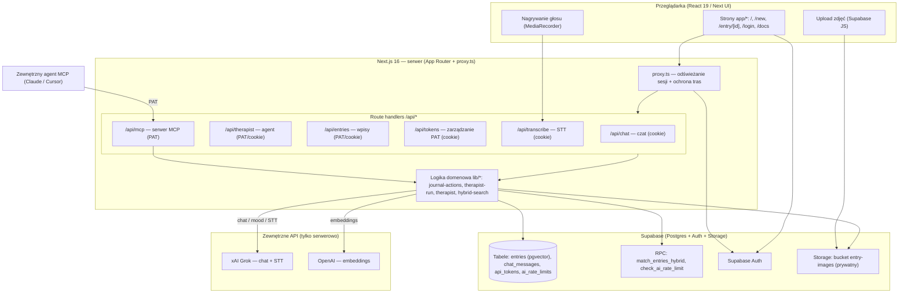

# Architektura — „Mój Dziennik"

> Dokument wygenerowany na podstawie kodu źródłowego repo (stan: gałąź `main`).
> Opiera się wyłącznie na plikach faktycznie znalezionych w projekcie. Miejsca
> niepotwierdzone oznaczono jako `[do weryfikacji]`.

## 1. Przegląd systemu

„Mój Dziennik" to webowa aplikacja dziennika osobistego zbudowana na Next.js 16
(App Router) z backendem Supabase (Postgres + Auth + Storage). Użytkownik pisze
wpisy (edytor TipTap, zdjęcia, dyktowanie głosowe), a każdemu wpisowi
przypisywany jest nastrój 1–5 — podany ręcznie lub wywnioskowany z treści przez
model Grok (xAI). Sercem produktu jest agent AI „psychoterapeuta" (persona
Anthony Robbins), który rozmawia z użytkownikiem w kontekście jego wpisów,
stosując wzorzec RAG: przed odpowiedzią przeszukuje historię hybrydowo
(wektory pgvector + full-text). Te same funkcje domenowe są wystawione na
zewnątrz dwoma kanałami — publicznym REST API i serwerem MCP — uwierzytelnianymi
osobistymi tokenami (PAT).

## 2. Diagram architektury



## 3. Komponenty

| Komponent | Odpowiedzialność | Technologia |
|---|---|---|
| Frontend (`app/`, `components/`) | UI dziennika: lista dni, edytor wpisu, panel czatu z agentem, galeria zdjęć, panel tokenów, dokumentacja `/docs` | Next.js 16 App Router, React 19, Tailwind 4, shadcn/Base UI, TipTap, lucide-react |
| `proxy.ts` + `lib/supabase/proxy-session.ts` | Odświeżanie sesji Supabase przy każdym żądaniu, ochrona tras (redirect na `/login`), `/api` i `/docs`/`/login` jako publiczne | Next.js 16 `proxy` (dawne middleware), `@supabase/ssr` |
| `/api/chat` | Czat z agentem w aplikacji; GET historia wątku dnia, POST nowa wiadomość | Route handler, sesja cookie (RLS) |
| `/api/therapist` | Publiczne API pytań do agenta (per użytkownik) | Route handler, PAT lub cookie |
| `/api/entries` | Publiczne API wpisów: POST dodaj (mood wnioskowany gdy brak), GET dzień | Route handler, PAT lub cookie |
| `/api/tokens` | Tworzenie/listowanie/odwoływanie PAT; plaintext zwracany jednorazowo | Route handler, sesja cookie, `node:crypto` |
| `/api/transcribe` | Transkrypcja nagrań głosowych (multipart `file`) | Route handler, cookie, xAI STT |
| `/api/mcp` (`app/api/[transport]`) | Serwer MCP z 3 narzędziami: `add_journal_entry`, `get_journal_day`, `ask_therapist` | `mcp-handler`, `@modelcontextprotocol/sdk`, transport Streamable HTTP, PAT |
| `lib/journal-actions.ts` | Walidacja + tworzenie/odczyt wpisów, współdzielone przez REST i MCP | TypeScript, Supabase JS |
| `lib/therapist-run.ts` | Rdzeń rozmowy: limit AI → kontekst (historia+wpisy+RAG) → pętla narzędzi → zapis | TypeScript |
| `lib/therapist.ts` | Persona, prompt systemowy, detekcja kryzysu, definicje narzędzi function-calling, budowa kontekstu | TypeScript |
| `lib/hybrid-search.ts` + `lib/embeddings.ts` | RAG: embedding zapytania (OpenAI) + RPC hybrydowy (wektor + full-text) | TypeScript, pgvector |
| `lib/grok.ts` | Cienki klient xAI: chat-completions (`/v1/chat/completions`) i STT (`/v1/stt`) | `fetch`, API zgodne z OpenAI |
| `lib/mood-infer.ts` | Wnioskowanie nastroju 1–5 z treści (fallback 3) | Grok chat |
| `lib/supabase/*` | Klienci: przeglądarka (`client`), serwer/cookie (`server`), service-role (`admin`), auth PAT (`api-auth`) | `@supabase/ssr`, `@supabase/supabase-js` |
| `lib/storage.ts`, `lib/entry-images.ts` | Store wpisów (useSyncExternalStore) + upload/signed URL zdjęć | Supabase JS, Storage |
| `scripts/*.mjs` | Narzędzia offline: generowanie embeddingów, seed zdjęć | Node ESM |

## 4. Źródła danych

Baza: Supabase Postgres (projekt ref `urucvunzbfojotfgkngr`). Wszystkie tabele
mają włączone RLS. Stan potwierdzony przez `list_tables`:

| Tabela | Co przechowuje | Jak odpytywana |
|---|---|---|
| `entries` | Wpisy: `content` (HTML z TipTap), `mood` (smallint 1–5, CHECK), `images text[]`, `embedding vector`, `created_at` (pełni rolę daty wpisu), `user_id` → `auth.users` | Klient cookie (RLS) z UI; service-role z jawnym filtrem `user_id` z API/MCP; `embedding` przez RPC hybrydowy |
| `chat_messages` | Historia czatu z agentem: `day` (date), `role` (`user`/`assistant`), `content` | Filtr po `user_id` + `day`, sortowane po `created_at` |
| `api_tokens` | PAT: `token_hash` (SHA-256, unique), `prefix`, `name`, `last_used_at` — nigdy plaintext | Weryfikacja po `token_hash` (service-role); zarządzanie przez cookie/RLS |
| `ai_rate_limits` | Liczniki limitu AI: PK `(user_id, window_kind)`, `window_kind` ∈ {minute, day}, `count` | Atomowo przez RPC `check_ai_rate_limit` (tylko service-role) |

Funkcje RPC (z migracji): `match_entries_hybrid` (RAG — wektor `<=>` + full-text
scalone przez RRF, z utwardzonym `search_path`) oraz `check_ai_rate_limit`
(limiter, odebrany roli `authenticated`).

Rozszerzenia/cechy Postgresa: `pgvector` (kolumna `entries.embedding`, model
`text-embedding-3-small`, 1536 wymiarów; indeks HNSW wg pamięci projektu
`[do weryfikacji]` — nie potwierdzony w plikach repo).

Storage: prywatny bucket `entry-images`; pliki pod `{userId}/{uuid}.{ext}`
(pierwszy segment ścieżki wymagany przez RLS); odczyt przez signed URL (TTL 1 h);
limit 10 MB/plik.

Zewnętrzne API danych:
- **xAI (Grok)** — chat-completions (rozmowa agenta, wnioskowanie nastroju) oraz
  STT (`/v1/stt`, transkrypcja). Domyślny model `grok-4-1-fast-non-reasoning`
  (nadpisywalny `XAI_MODEL`).
- **OpenAI** — embeddingi zapytań do RAG (`/v1/embeddings`).

## 5. Integracje i połączenia

| Integracja | Kierunek | Uwierzytelnianie |
|---|---|---|
| Supabase Postgres/Auth/Storage | out (serwer i klient → Supabase) | Klucz publishable/anon (klient, cookie), klucz service-role/secret (serwer) |
| Serwer MCP `/api/mcp` | in (agent zewnętrzny → aplikacja) | PAT `Bearer mdz_pat_...`, weryfikowany przez `withMcpAuth` → `resolveUserIdFromToken` |
| Publiczne REST `/api/entries`, `/api/therapist` | in (klient API → aplikacja) | PAT `Bearer mdz_pat_...` lub sesja cookie |
| xAI Grok (chat + STT) | out | `Bearer XAI_API_KEY` (tylko serwerowo) |
| OpenAI embeddings | out | `Bearer OPENAI_API_KEY` (tylko serwerowo) |

MCP: transport Streamable HTTP (`disableSse: true`), `basePath: /api`,
`maxDuration: 60`. Segment dynamiczny `[transport]` obsługuje wyłącznie
`/api/mcp` (trasy statyczne mają pierwszeństwo). Brak webhooków, kolejek i cron
zdefiniowanych w repo.

Zmienne środowiskowe (`.env.local`) — nazwy i rola, bez wartości:

| Zmienna | Rola | Ekspozycja |
|---|---|---|
| `NEXT_PUBLIC_SUPABASE_URL` | URL projektu Supabase | klient + serwer |
| `NEXT_PUBLIC_SUPABASE_ANON_KEY` | Klucz publishable/anon | klient + serwer |
| `SUPABASE_SECRET_KEY` | Klucz service-role (omija RLS, weryfikacja PAT, limiter) | tylko serwer |
| `XAI_API_KEY` | Klucz xAI Grok (chat + STT) | tylko serwer |
| `XAI_MODEL` (opcjonalna) | Nadpisanie modelu Grok | tylko serwer |
| `OPENAI_API_KEY` | Klucz OpenAI (embeddingi) | tylko serwer |

## 6. Przepływ danych

**Dodanie wpisu (UI lub API/MCP):** tekst → walidacja (`createEntryForUser`) →
jeśli brak `mood`, wnioskowanie przez Grok (`inferMood`, fallback 3) → konwersja
tekst→HTML (`textToHtml`) → insert do `entries` z jawnym `user_id`. Zdjęcia są
ładowane osobno z przeglądarki bezpośrednio do bucketa, a ścieżki trafiają do
`entries.images`. Embeddingi wpisów generowane są offline skryptem
`scripts/generate-embeddings.mjs` `[do weryfikacji: brak triggera realtime]`.

**Rozmowa z agentem (`askTherapist`):**
1. `enforceAiRateLimit` — limit 6/min i 80/dzień per użytkownik (RPC, fail-open).
2. Równolegle: historia wątku dnia + wszystkie wpisy użytkownika + **RAG**
   (`hybridSearchEntries`: embedding pytania w OpenAI → RPC `match_entries_hybrid`).
3. Złożenie promptu systemowego: persona + (warunkowo) moduł kryzysowy
   `CRISIS_PROMPT` przy wykryciu wzorców + kontekst otwartego dnia + pobrane wpisy.
4. Pętla function-calling (max 4 rundy): narzędzia `get_mood_timeline`,
   `get_all_entries`, `search_entries`.
5. Zapis pytania i odpowiedzi do `chat_messages`; zwrot tekstu.

**Transkrypcja głosu:** nagranie (multipart) → sesja + `enforceAiRateLimit` →
xAI STT (`language=pl`) → zwrot tekstu wstawianego do edytora.

**Bramka human-in-the-loop:** nastrój wywnioskowany przez AI oraz transkrypcja
trafiają do edytora/wpisu i podlegają edycji przez użytkownika przed zapisem
`[do weryfikacji — zakres edycji nastroju w UI]`. Dla sygnałów kryzysu agent
kieruje do kontaktu z człowiekiem/specjalistą (numery pomocowe PL) — to nie
twarda bramka, lecz wzmocnienie promptu. Brak mechanizmu zatwierdzania
odpowiedzi agenta przez człowieka.

## 7. Hosting i deployment

- **Framework:** Next.js 16.2.6, skrypty `next dev` / `next build` / `next start`
  (`package.json`). `next.config.ts` bez nietypowej konfiguracji.
- **Backend zarządzany:** Supabase (Postgres, Auth, Storage) — projekt ref
  `urucvunzbfojotfgkngr`; schemat wersjonowany migracjami (11 migracji,
  najnowsza `ai_rate_limit_revoke_authenticated`).
- **Hosting aplikacji:** README to domyślny szablon `create-next-app`
  sugerujący Vercel — **nie ma potwierdzenia, gdzie faktycznie działa**
  `[do weryfikacji]`. Brak `Dockerfile`, `docker-compose.yml`, konfiguracji
  tmux i definicji cron w repo.
- **Środowisko lokalne:** `.env.local` z kluczami; uruchomienie `npm run dev`
  (port 3000). Node 24 LTS (uwaga: w niektórych powłokach brak `node` w PATH —
  wg pamięci projektu).

## 8. Otwarte pytania / TODO

- **⚠️ Sekrety w repo:** plik `.env.local` zawiera realne wartości
  `SUPABASE_SECRET_KEY`, `XAI_API_KEY` i `OPENAI_API_KEY`. Należy potwierdzić,
  czy nie jest commitowany (`.gitignore`) i **zrotować klucze**, jeśli kiedykolwiek
  trafił do historii git. (W tym dokumencie wartości celowo pominięto.)
- Hosting produkcyjny i pipeline CI/CD — nieudokumentowane w repo `[do weryfikacji]`.
- Indeks HNSW na `entries.embedding` — wynika z pamięci projektu, nie z plików
  repo; potwierdzić w migracjach/DB `[do weryfikacji]`.
- Generowanie embeddingów dla nowych wpisów: czy jest automatyczne (trigger /
  funkcja DB), czy tylko offline przez `scripts/generate-embeddings.mjs`
  `[do weryfikacji]`.
- Zakres edycji wywnioskowanego nastroju w UI przed zapisem `[do weryfikacji]`.
- Konfiguracja domeny, redirectów Auth i ustawień Storage (limity, CORS) po
  stronie panelu Supabase — poza repo `[do weryfikacji]`.
```
